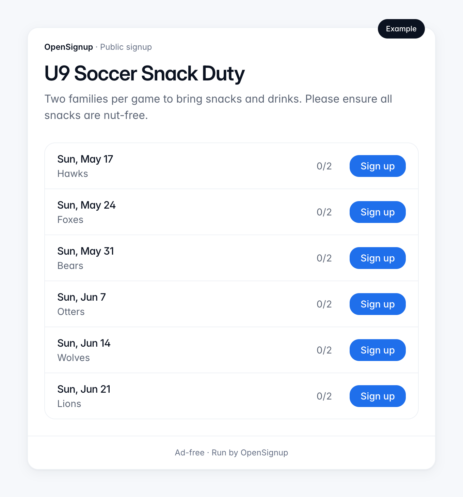

<p align="center">
  
</p>

<h1 align="center">OpenSignup</h1>

<p align="center">
  <strong>Ad-free, open-source sign-up sheets. No accounts for participants — ever.</strong>
</p>

<p align="center">
  <a href="https://opensignup.org"><strong>Use it free at opensignup.org →</strong></a>
  <br />
  No credit card, publish a signup in minutes. There's a live example on the homepage you can poke without signing in.
</p>

<p align="center">
  
</p>

Coordinate snack rotations, potlucks, volunteer shifts, and carpools. Made for school parents, coaches, and community organizers who are tired of ad-soaked signup tools.

## Why OpenSignup

- **Participants are not users.** Parents click a link, pick a slot, done. No account required, ever, to sign up.
- **Ad-free, structurally.** The code is AGPL-3.0 open source — "we won't bait-and-switch you" is enforced by the license, not a pricing page.
- **Slots are the atom, not questions.** Commitments, capacity, reminders — not a form builder.
- **Self-hostable from day one.** `git clone`, one Docker Compose, zero vendor accounts required.
- **AI-native.** Clean primitives designed for Claude, MCP, and future agent surfaces.

Licensed under [AGPL-3.0](LICENSE). If you run a modified version of OpenSignup as a network service, the AGPL requires you to offer your users the corresponding source. See the [AGPL FAQ](https://www.gnu.org/licenses/agpl-3.0.html) for details.

## Quickstart (five minutes)

```bash
git clone https://github.com/richshaw/OpenSignup.git && cd OpenSignup
cp .env.example .env.local
docker compose up -d           # local Postgres on :5433
pnpm install
pnpm db:migrate
pnpm dev                        # http://localhost:3000
```

In a second terminal:

```bash
pnpm worker                     # reminder worker
```

Open `http://localhost:3000`, request a magic link with any email, and look at the server log — with `EMAIL_TRANSPORT=console`, login links are printed directly to stdout for local development.

## Self-host

Build the Docker image from source with the included `Dockerfile` (a prebuilt registry image is planned but not yet published). See `docker-compose.prod.yml` for the canonical setup (app + db + migrate + worker). Configuration is entirely via environment variables — see `.env.example`.

Email transport is pluggable (`console` for dev, `smtp` for generic self-host, `resend` for hosted). No other external accounts required.

### Branding your instance

The footer, privacy policy, terms, and cookies pages are instance-agnostic — they read these `NEXT_PUBLIC_*` values and inline them into the client bundle. **Required** values fail the build loudly if missing; there are no silent defaults, since shipping the upstream project's contact email or jurisdiction on your instance is worse than a build failure.

- `NEXT_PUBLIC_INSTANCE_NAME` — display name (required)
- `NEXT_PUBLIC_SUPPORT_EMAIL` — contact email (required)
- `NEXT_PUBLIC_SOURCE_URL` — source-code URL surfaced to comply with AGPL-3.0 §13 (required, must be https); point at your fork if you've modified the code, otherwise leave it pointed at upstream
- `NEXT_PUBLIC_GOVERNING_LAW` — jurisdiction clause for the terms of service (required)
- `NEXT_PUBLIC_OPERATOR_NAME` — your name or organisation; appears as the data controller (optional; falls back to "the operator of this instance")

**These values must be present at build time**, not just runtime — Next.js inlines them into the prerendered legal pages, so a runtime `.env` file or `docker run -e` is too late. How you pass them depends on how you deploy:

- **Docker Compose** (`docker-compose.prod.yml`) — set them in the same `.env` file at the project root that Compose already reads for variable substitution. Compose passes them through as `build.args` and fails fast if any required value is missing.
- **`docker build`** — pass each as `--build-arg NEXT_PUBLIC_INSTANCE_NAME=…`.
- **Fly.io** — set under `[build.args]` in `fly.toml` (the included file is the upstream's deployment; replace with your own values). `fly secrets` are runtime-only and won't work here.
- **Local dev** (`pnpm dev`) — set them in `.env.local`; Next.js reads it on each build/restart.

## Status

v1 — deliberately narrow. Date, time, item, role, and quantity slots; capacity with race-safe commits; email reminders; magic-link auth for organizers only.

## Contributing

See [`CONTRIBUTING.md`](CONTRIBUTING.md). Contributors retain copyright on their contributions and license them under AGPL-3.0.
