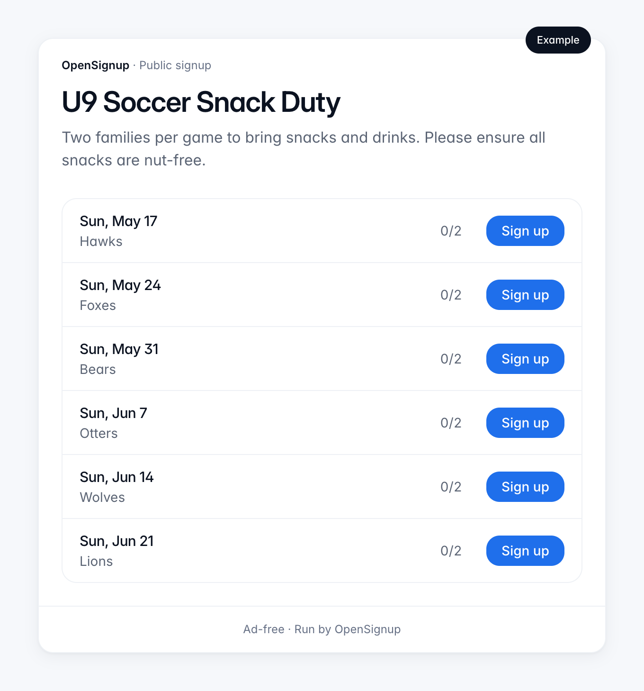

<p align="center">
  
</p>

<h1 align="center">OpenSignup</h1>

<p align="center">
  <strong>Ad-free, open-source sign-up sheets. No accounts for participants — ever.</strong>
</p>

<p align="center">
  <a href="https://opensignup.org"><strong>Use it free at opensignup.org →</strong></a>
  <br />
  No credit card. Publish a signup in minutes, or try the live example on the homepage without signing in.
</p>

<p align="center">
  
</p>

Coordinate snack rotations, potlucks, volunteer shifts, and carpools. Made for school parents, coaches, and community organizers who are tired of ad-soaked signup tools.

## Why OpenSignup

- **No accounts for participants.** People click a link, pick a slot, and they're done.
- **Ad-free, structurally.** The code is AGPL-3.0 open source — "we won't bait-and-switch you" is enforced by the license, not a pricing page.
- **Slots, not forms.** Each signup has its own fields (text, date, time, number, or a list of choices). Slots stop taking people when they're full, and participants can get a reminder email the day before.
- **Self-hostable.** One Docker Compose file runs everything. The only outside service you need is email.
- **Works with AI assistants.** Organizers can connect Claude, ChatGPT, or any MCP client to create and manage signups. See [`docs/connect-ai-assistant.md`](docs/connect-ai-assistant.md).

## Run it locally

You need Node 22.12 or later, pnpm (`corepack enable` installs it), and Docker.

```bash
git clone https://github.com/richshaw/OpenSignup.git && cd OpenSignup
cp .env.example .env.local
docker compose up -d   # Postgres on :5433
pnpm install
pnpm db:migrate
pnpm dev               # http://localhost:3000
```

Open `http://localhost:3000` and sign in with any email address. Nothing is sent: with `EMAIL_TRANSPORT=console`, the sign-in email is printed in the `pnpm dev` terminal.

Reminder emails need the worker. Run it in a second terminal:

```bash
pnpm worker
```

## Self-host

The easiest way to run your own OpenSignup is Docker Compose. It runs the web app, the reminder worker and a Postgres database, and it prepares the database for you. There is no ready-made image yet, so Compose builds one from the source code. The first build takes a few minutes.

1. Copy the example settings:

   ```bash
   cp .env.example .env
   ```

2. Open `.env` and fill in:
   - `POSTGRES_PASSWORD`: a password for the database, for example the output of `openssl rand -hex 24`. Do not use the `$` character.
   - `AUTH_SECRET`: a random string of 32 characters or more, for example the output of `openssl rand -hex 32`.
   - `AUTH_URL` and `NEXT_PUBLIC_APP_URL`: the address people use to open your site, for example `https://signups.example.org`.
   - The branding values in [Branding your instance](#branding-your-instance).
   - The email settings. Organizers sign in with a link that we email to them, so you need working email to sign in. For most email providers, set `EMAIL_TRANSPORT=smtp`, fill in the `SMTP_` values, and set `EMAIL_FROM` to an address your provider lets you send from. To use Resend instead, set `EMAIL_TRANSPORT=resend` and `RESEND_API_KEY`.

   You do not need to change `DATABASE_URL`. Compose connects the app to its own database. To use a Postgres database you already run instead, set `EXTERNAL_DATABASE_URL`. Compose still starts its own database, which the app then does not use, so you still need `POSTGRES_PASSWORD`.

3. Start OpenSignup:

   ```bash
   docker compose -f docker-compose.prod.yml up -d --build
   ```

The site runs on port 3000. To use a different port, set `PORT` in `.env`. If people open the site on that port, put the port in `AUTH_URL` and `NEXT_PUBLIC_APP_URL` too. Compose does not set up HTTPS, so for a public site put a reverse proxy (for example Caddy or nginx) in front of it.

When you change `.env`, run the same command again. Values that start with `NEXT_PUBLIC_` are built into the app, and `--build` picks up the new ones.

Organizers can connect AI assistants with no extra setup, as long as `AUTH_URL` is your site's HTTPS address. See [For self-hosters](docs/connect-ai-assistant.md#for-self-hosters).

### If something goes wrong

- To see what happened, read the logs: `docker compose -f docker-compose.prod.yml logs migrate web worker`.
- If the logs say `password authentication failed`, the database still has the password it first started with. Put that password back in `POSTGRES_PASSWORD`. On a new install with no data to keep, you can instead start again with an empty database: `docker compose -f docker-compose.prod.yml down -v`. This deletes all data.

### Other ways to run it

You can run the image from the `Dockerfile` on any container host, or run the app directly with **Node 22.12 or later** and your own Postgres. Either way, you run three parts:

- `pnpm db:migrate`, before the first start and after each update. It prepares the database.
- The web app: `node server.js` in the image, or `pnpm build` and then `pnpm start` from the source code.
- `pnpm worker`, which sends reminder emails. It runs next to the web app, as a second process.

All settings are environment variables, listed in `.env.example`. For Fly.io, start from `fly.example.toml`.

### Branding your instance

The footer and the privacy, terms and cookies pages show your details, not the OpenSignup project's. They come from these values:

- `NEXT_PUBLIC_INSTANCE_NAME`: the name of your site (required)
- `NEXT_PUBLIC_SUPPORT_EMAIL`: the email address people can contact (required)
- `NEXT_PUBLIC_SOURCE_URL`: where people can get the source code, as the AGPL-3.0 license (§13) requires (required, must be https). If you changed the code, point it at your fork. If not, leave it as it is.
- `NEXT_PUBLIC_GOVERNING_LAW`: the jurisdiction for your terms of service (required)
- `NEXT_PUBLIC_OPERATOR_NAME`: your name or organisation, shown as the data controller (optional; without it the pages say "the operator of this instance")

If a required value is missing, the build stops with an error. That is on purpose: a failed build is better than a site that shows someone else's contact email or jurisdiction. Local development (`pnpm dev`) is the exception: it shows placeholders such as "OpenSignup (dev)" instead, so you can [run it locally](#run-it-locally) before you fill these in.

These values are built into the app, so they must be set when you build it. Setting them only when the app starts (for example with `docker run -e`) is too late:

- **Docker Compose**: put them in `.env`. Compose passes them to the build.
- **`docker build`**: pass each one as `--build-arg NEXT_PUBLIC_INSTANCE_NAME=…`, and `NEXT_PUBLIC_APP_URL` the same way.
- **Fly.io**: copy the template (`cp fly.example.toml fly.toml`) and set your values under `[build.args]`. Git ignores `fly.toml`, so your settings stay out of the repository. `fly secrets` only apply when the app starts, so they do not work here.
- **Local development** (`pnpm dev`): put them in `.env.local`. Next.js reads it each time it starts.

## Contributing

See [`CONTRIBUTING.md`](CONTRIBUTING.md). To report a security issue, see [`SECURITY.md`](SECURITY.md).

## License

[AGPL-3.0](LICENSE). Contributors keep the copyright on their contributions and license them under the same terms. If you run a modified version of OpenSignup as a network service, the AGPL requires you to offer its source code to your users. See the [AGPL FAQ](https://www.gnu.org/licenses/agpl-3.0.html) for details.
